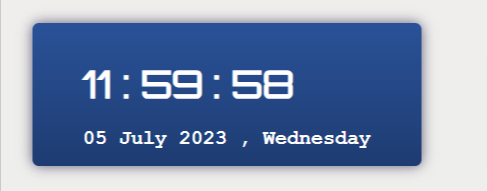
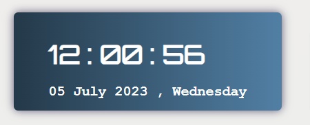

# Clock
This is a simple JavaScript application that displays the current date and time in real-time. It utilizes the Date object and DOM manipulation to update the clock every second.

## Features

- Displays the current time with hours, minutes, and seconds.
- Formats the time to always show two digits for hours, minutes, and seconds.
- Displays the current date with the day of the week, month, day, and year.

## Image

  
## Code Explanation
- The `updateTime` function is defined to retrieve the current date and time using the Date object and update the corresponding elements' innerHTML with the formatted time.When using `setInterval()`, we have to pass the function reference as the first argument, not the result of the function call. So, instead of `setInterval(updateTime(),1000);`, it should be `setInterval(updateTime, 1000)`;. 

- The time is formatted using the `toString().padStart()` method to ensure that hours, minutes, and seconds always have two digits.

- The `setInterval` function is used to call the `updateTime` function every second, which updates the clock in real-time.

- The current date is obtained using the Date object, and the day of the week, month, day, and year are extracted and displayed using DOM manipulation.
- Remember not to declare `currDate` as a global variable as it will not be updated when `updatetime()` is called repeatedly.
- The transition.js file contains JavaScript code that transitions the background of the .content div every second.
